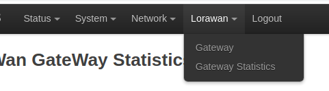
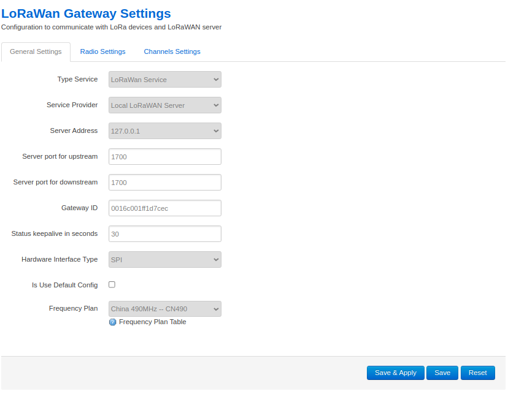
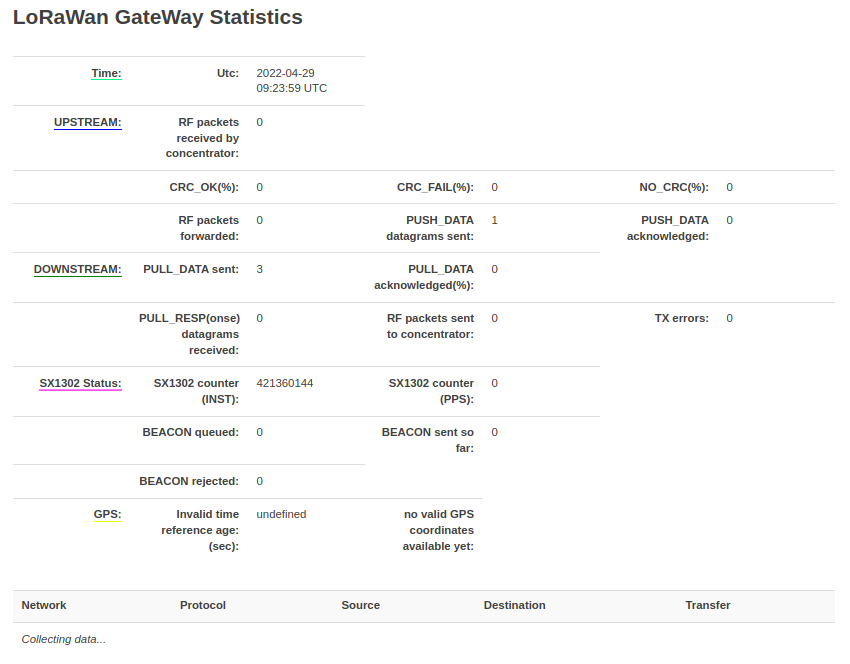

# openwrt-lorawan-gateway
The lorawan gateway package under the openwrt system platform

<<<<<<< HEAD
## Menu Bar

## Configuration Interface

## Statistics Interface

# Usage

## clone code

- cd xxxx/package/
- git clone --recurse-submodules https://github.com/yunzhaoyu2050/openwrt-lorawan-gateway.git

## configuration before compilation
=======
# clone code
- cd xxxx/package/
- git clone --recurse-submodules https://github.com/yunzhaoyu2050/openwrt-lorawan-gateway.git

# configuration before compilation
>>>>>>> 41582cb4233cf297646e26d0583aae826767a8b3
1.edit openwrt-lorawan-gateway/Makefile
 
- BOARD_NAME:=MC7628_GAS  -->  (MC7628_GAS or QUECTEL_SX1302 This will affect the choice of web interface. If you need to customize it, you need to modify the files in the platform folder.)
- SX1302_RESET_PIN:=5  -->  (reset pin)

2.make menuconfig --> Utilities -->  <*> lorwan-gateway
 

<<<<<<< HEAD
## compile
=======
# compile
>>>>>>> 41582cb4233cf297646e26d0583aae826767a8b3
- clear && make package/openwrt-lorawan-gateway/clean && make package/openwrt-lorawan-gateway/compile V=s

# Source description
Depends on the modified sx1302 repository:https://github.com/yunzhaoyu2050/sx1302_hal.git   branch:openwrt
